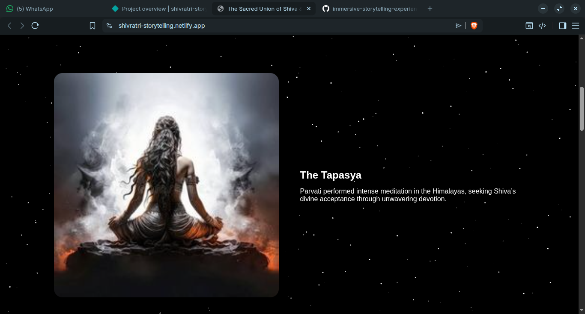

# Shivratri Project

**Description:**  
This is an immersive storytelling experience for Shivratri, built with HTML, CSS, and JavaScript. It showcases interactive elements, animations, and multimedia assets for a festive experience.

---

## Technologies Used
- HTML
- CSS
- JavaScript

---

## Project Structure
- `index.html` → Main page  
- `style.css` → Styling and layout  
- `script.js` → Interactive functionality  
- `assets/` → Images, audio, and other resources (including screenshots)

---

## Preview


---

## Live Preview
- **GitHub Pages:** [View Here](https://rajatsec.github.io/immersive-storytelling-experience/)  
- **Netlify:** [View Here](https://shivratri-storytelling.netlify.app)  <!-- Replace with your actual Netlify URL -->

---

## How to Run Locally
1. Clone the repository:  
```bash
git clone https://github.com/rajatsec/immersive-storytelling-experience.git# immersive-storytelling-experience
